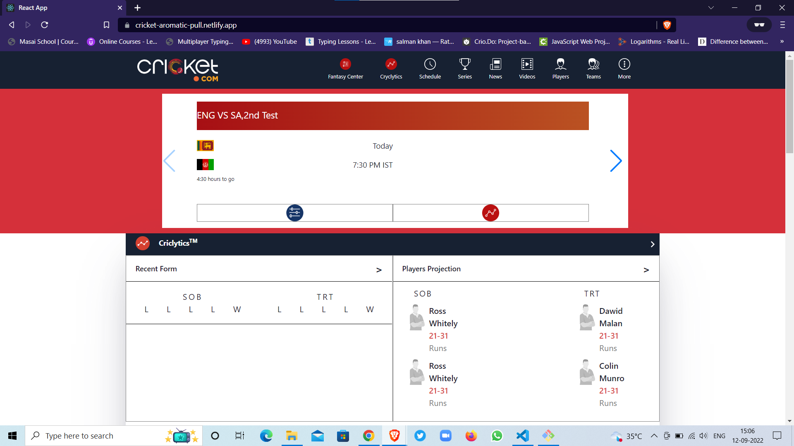
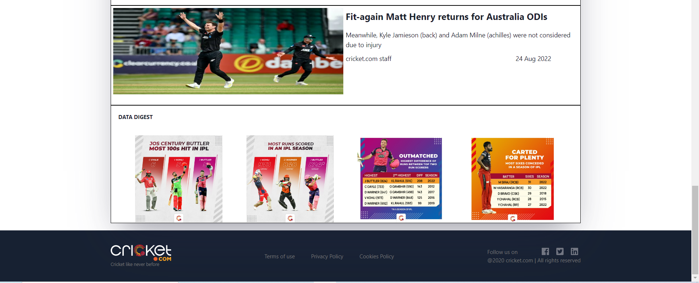
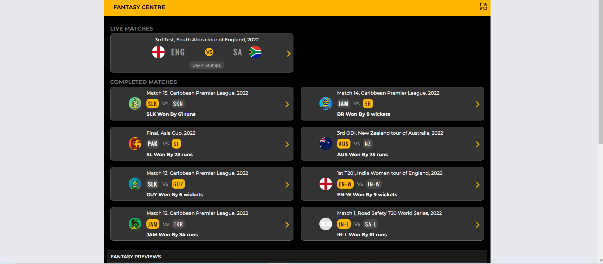
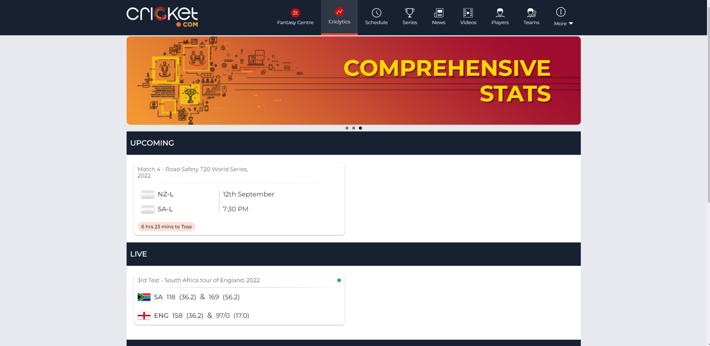
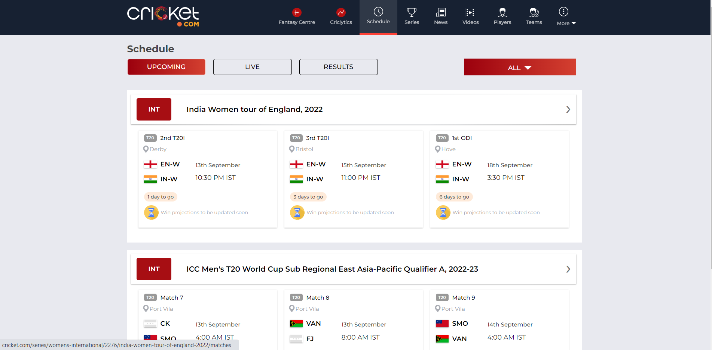
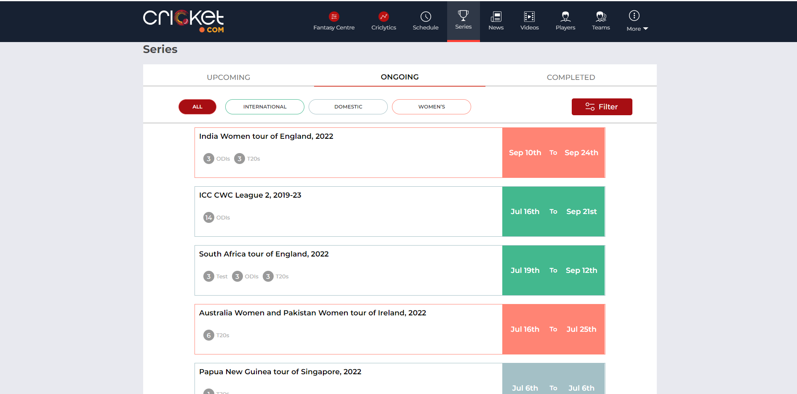
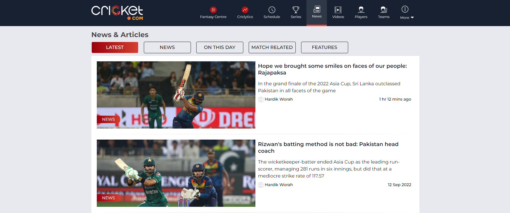

<h1>cricket.com</h1>

  

    This is our Construct week project in unit 5 at <a href="https://www.masaischool.com/"> Masai School </a> 
     
  

 
 

<!-- ABOUT THE PROJECT -->
<h4>Starting from ball-by-ball coverage and live score tracking, to housing and archiving every type of cricket data, along with news, opinions, and insights from around the world of cricket, Cricket.com is the most exhaustive yet comprehensive app the gentlemen's game has ever seen. </h4>

<h2>Stack and Libraries Used</h2>
<ul>
  <li>React</li>
  <li>Redux</li>
  <li>json-server</li>
  <li>Chakra-UI</li>
</ul>
 
 
<h3>Deployed Link</h3>
<a href="https://cricket-aromatic-pull.netlify.app/
">https://cricket-aromatic-pull.netlify.app/
</a>
 
 
<h2>Some Glimpse of the website</h2>
 
 

<h4>Landing Page</h4>

<h4>Footer</h4>

<h4>Fantasy Centre</h4>

<h4>Criclytics</h4>

<h4>Schedule</h4>

<h4>Series</h4>

<h4>News</h4>

<h2> Team Members</h2>

1. Fahiz
2. Rajkumar
3. Salman
4. Aman
5. Arungoud 

(<a href="#top">back to top</a>)

<!-- ACKNOWLEDGMENTS -->

## Acknowledgments

This project would have not been possible without

- Masai School's -Instructors
- Prabhanjan Padhye
- Manish Kumar

(<a href="#top">back to top</a>)

